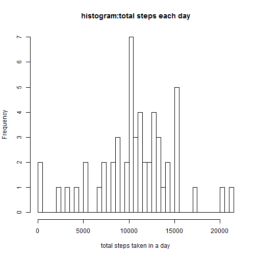
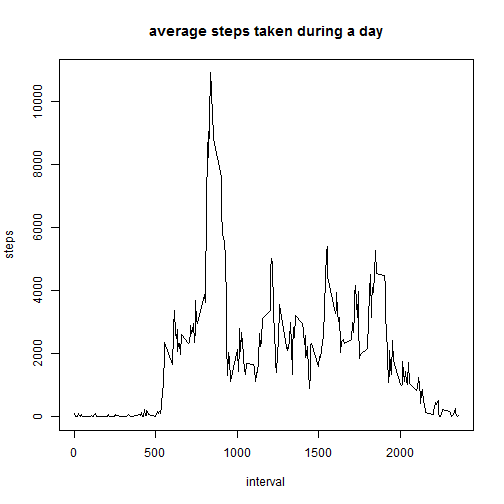
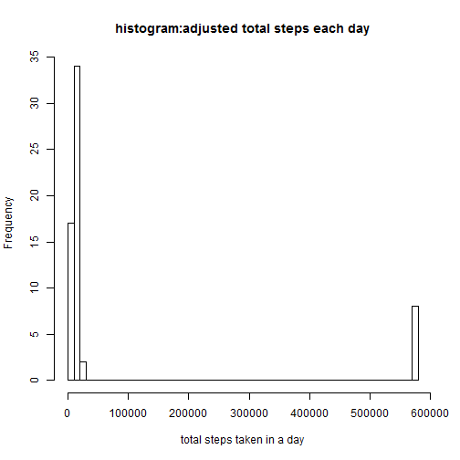
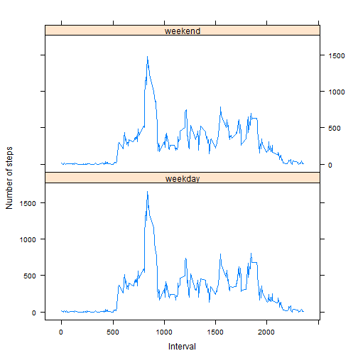

# Project 1 of Reproducible Research

# Loading and preprocessing the data

```r
activity<-read.csv("activity.csv", na.string="NA",header=TRUE, colClasses=c("numeric", "character", "integer"))
activity$date<-as.Date(activity$date, "%Y-%m-%d")
options(scipen = 10, digits = 2)
```

# 1. What is mean total number of steps taken per day?

```r
stepsAllDays<-aggregate(activity$steps, list(activity$date), sum)
colnames(stepsAllDays)<-c("date", "steps")

# create histogram
hist(stepsAllDays$steps,breaks=length(stepsAllDays$date),xlab="total steps taken in a day", main="histogram:total steps each day")
```



```r
#calculate mean and median
meanSteps<-mean(stepsAllDays$steps, na.rm=TRUE)
medianSteps<-median(stepsAllDays$steps, na.rm=TRUE)
```
Mean of total number of steps taken per day is 10766.19.
Median of total number of steps taken per day is 10765

# 2. What is the average daily activity pattern?

```r
stepsAllIntervals<-aggregate(activity$steps, list(activity$interval), na.rm=TRUE,sum)
colnames(stepsAllIntervals)<-c("interval", "steps")
with(stepsAllIntervals, plot(interval, steps, type="l", main="average steps taken during a day"))
```



```r
IntervalMax<-stepsAllIntervals[which.max(stepsAllIntervals$steps),c("interval")]
```
The time 5-minute interval on average across all the days in the dataset contains the maximum number of steps is 835

# 3. Imputing missing values

```r
# total number of record with missing values
naSum<-sum(rowSums(is.na(activity))>0)
```

The total number of missing values in the dataset is total number of record with missing value:2304

# fill NA values with mean steps of the interval

```r
activityFilled=activity
for(i in 1:nrow(activityFilled)) {
    if (is.na(activityFilled[i, "steps"]) )
    {
       # located an interval with NA steps
       currentInteval=activityFilled[i, "interval"]
       #print(paste0("current internval:",  currentInteval))
       
       # find the mean steps for the interval
       meanSteps<-stepsAllIntervals[stepsAllIntervals$interval==currentInteval,"steps"]
       
       # fill the steps of the current interval with the mean steps of the interval
       activityFilled[i, "steps"]<-meanSteps
       #print(paste0("setting internval:",  currentInteval, " ", activity[i, "steps"], "->", activityFilled[i, "steps"]))
    }
}


stepsAllDaysAdjusted<-aggregate(activityFilled$steps, list(activityFilled$date), sum)
colnames(stepsAllDaysAdjusted)<-c("date", "steps")
hist(stepsAllDaysAdjusted$steps,breaks=length(stepsAllDaysAdjusted$date),xlab="total steps taken in a day", main="histogram:adjusted total steps each day")
```



```r
meanStepsAdjusted<-mean(stepsAllDaysAdjusted$steps, na.rm=TRUE)
medianStepsAdjusted<-median(stepsAllDaysAdjusted$steps, na.rm=TRUE)
```
With missing values filled, mean total number of steps taken per day is different from when the values are not filed: TRUE

With missing values filled, median total number of steps taken per day is different from when the values are not filed: TRUE

#4. Are there differences in activity patterns between weekdays and weekends?

```r
library(lattice)
convertToWeekDayOrWeekEndDay<-function(x) 
{
     if ((weekdays(x) == "Sunday") |(weekdays(x) == "Saturday"))
     {
        return("weekend")
     } else
     {
        return("weekday")
     }
}

activityFilled$dayOfWeek<-sapply(activityFilled$date, convertToWeekDayOrWeekEndDay)
activityFilled$dayOfWeek<-as.factor(activityFilled$dayOfWeek)
weekdayActivity<-activityFilled[activityFilled$dayOfWeek=="weekday",]
weekendActivity<-activityFilled[activityFilled$dayOfWeek=="weekend",]

weekdayStepsAve<-aggregate(weekdayActivity$steps, list(weekdayActivity$interval), mean)
weekendStepsAve<-aggregate(weekendActivity$steps, list(weekendActivity$interval), mean)
colnames(weekdayStepsAve)<-c("interval", "steps")
colnames(weekendStepsAve)<-c("interval", "steps")
weekdayStepsAve$dayOfWeek<-rep("weekday", nrow(weekdayStepsAve))
weekendStepsAve$dayOfWeek<-rep("weekend", nrow(weekendStepsAve))
stepsAveWeekOfDay<-rbind(weekdayStepsAve,weekendStepsAve)
p<-xyplot(steps~interval|dayOfWeek, data=stepsAveWeekOfDay, layout=c(1,2), type="l", ylab="Number of steps", xlab="Interval")
print(p)
```


